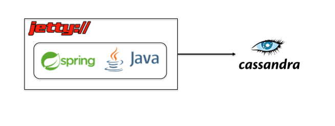

# User Service

Microservice for user functionality. 

Technologies:

+ Java 6
+ Spring Framework 4
+ Jetty
+ Datastax Cassandra Driver

Built using Java with the Spring framework. It runs inside a Jetty server (a lightweight web container/server). Application connects to
Cassandra datastore (NoSQL)

Below:

